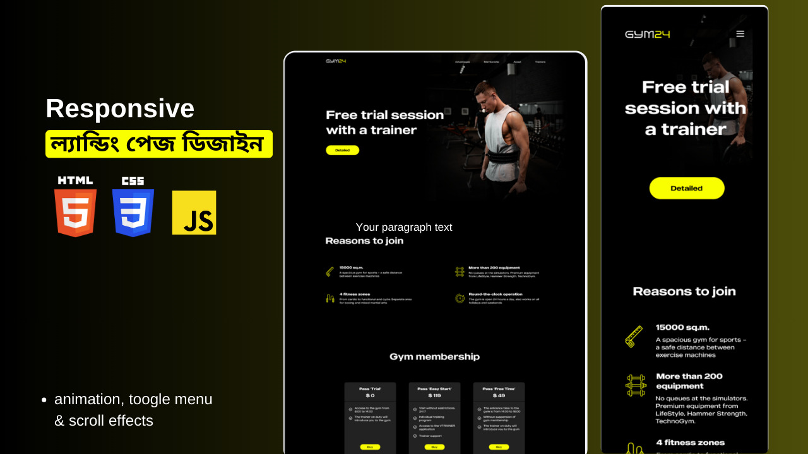

# gym24-landing-page-html-css-js-project

## Project Overview

This project is a landing page for a gym. It is a simple, responsive page that uses HTML, CSS, and JavaScript.

## Technologies Used

- HTML
- CSS
- JavaScript

## Features

- Responsive design
- Smooth animations
- Scroll reveal
- Scrollbar

## Installation

1. Clone the repository
2. Open the `index.html` file in your browser

## Usage

1. Open the `index.html` file in your browser
2. Scroll down to see the animations and scroll reveal
3. Scroll up to see the scrollbar

## Live demo: [GYM24] (https://gym-24-project.netlify.app/)

## Contributing

1. Fork the repository
2. Create a new branch
3. Make your changes and commit them
4. Push your changes to your fork
5. Create a pull request

## License

This project is licensed under the MIT License. See the `LICENSE` file for details.

## Contact

If you have any questions or feedback, please contact me at Facebook: [https://www.facebook.com/mdalmamunit427].

## Acknowledgments
- [Design] (https://www.figma.com/community/file/1260888393015798147)
- [ScrollReveal](https://scrollrevealjs.org/)
- [Unpkg](https://unpkg.com/)

